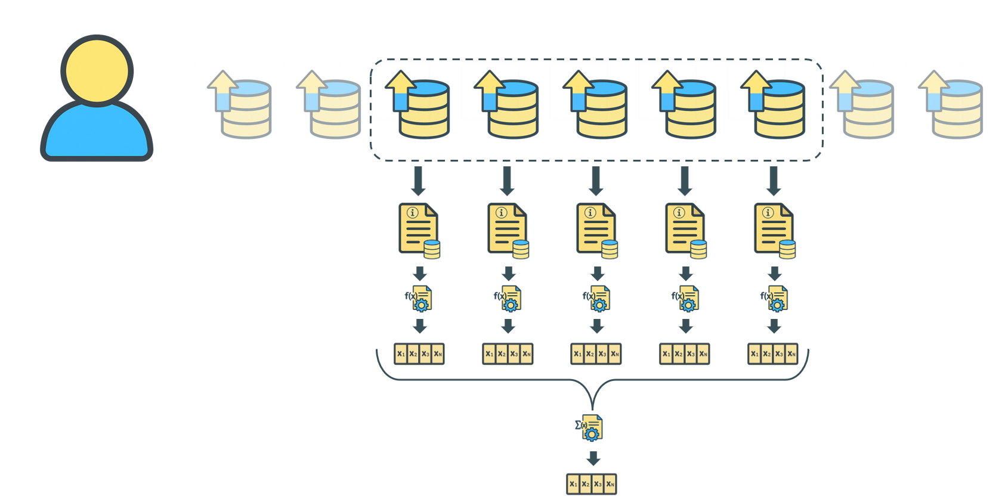

# Meta Kaggle Hackathon

In this repo we are going to dive into the [Meta-kaggle-hackathon](https://www.kaggle.com/competitions/meta-kaggle-hackathon) contest. 

---

# Echoes of Interest: Finding Similarity in Kaggle Datasets

**Dataset Recommendation through DOC2VEC**



## Overview

_Echoes of Interest_ is a recommendation system that suggests Kaggle datasets and similar users based on voting behavior and dataset semantics. It leverages document embeddings (via Doc2Vec) trained on dataset metadata to model user interests and enable two primary types of recommendations:

* **“People who liked this dataset also liked...”**
* **“You might want to connect with this user...”**

## Objectives

* Help users discover meaningful and semantically aligned datasets.
* Identify like-minded individuals to encourage networking and collaboration.
* Validate whether upvote interactions can serve as reliable behavioral signals for recommendation.

## Core Methodology

* **Data Sources**: Meta Kaggle (DatasetVotes, Datasets, DatasetVersions), plus UC Irvine ML Repository (external metadata).
* **User Interaction Modeling**: Many-to-many relations between users and datasets via upvotes.
* **Content Representation**: Each dataset is represented as a concatenated document (Title + Subtitle + Description).
* **Embeddings**: Trained Doc2Vec model (128-dim) over Kaggle and UCI text.
* **Feature Construction**: User interest vectors via averaging embeddings of last 5 upvoted datasets.

## Pipeline Summary

1. **Preprocessing**

   * Filter out auto-likes and outliers (e.g., high-speed, high-volume voters).
   * Keep only datasets from 2020 onward.

2. **Splits**

   * Train: Before 2025-01-01
   * OOT (Out-of-Time): After 2025-01-01
   * Further split by user into train/test/val.

3. **Model Training**

   * Doc2Vec trained on enriched corpus (Kaggle + UCI).
   * Save model for inference.

4. **Embedding Generation**

   * Infer document vectors for all datasets.
   * Aggregate user preferences via average of 5 past vectors.

5. **Evaluation**

   * Use cosine similarity and Jaccard distance.
   * Evaluate recommendations across val/test/OOT splits.

## Data Sources

### Meta Kaggle CSVs

* `Datasets.csv` – metadata, ownership.
* `DatasetVotes.csv` – user upvotes.
* `DatasetVersions.csv` – historical versions and text.

### External (UCI ML Repo)

* Parquet file with title, subtitle, description for additional dataset variety.

### Complementary Datasets

* `Users.csv` – user profiles.
* `UserFollowers.csv` – social connections.

## Recommendation Strategy

Recommend datasets with:

* **High cosine similarity** (semantic alignment).
* **Low Jaccard overlap** (non-redundant suggestions).

If overlap is too high, recommend following the user instead of content.

## Why It Matters

In a world flooded with data, guided discovery is crucial. This system surfaces datasets users didn’t know how to search for and highlights peers who share their curiosity. It builds bridges—not just between datasets, but between people.

## Evaluation Highlights

* High semantic similarity between user histories, even when direct overlap is zero.
* Stable model performance across temporal gaps (OOT).
* Rich interplay between collaborative and content-based filtering.

## Directory Structure
---
```
meta-kaggle-hackathon/
├── assets/
│   ├── icons/
│   ├── images/
│   ├── utils/
│   └── .gitkeep
├── data/
│   ├── archive/               # Raw Kaggle dataset files (e.g., Datasets.csv, DatasetVotes.csv)
│   ├── external/              # External sources like UCI ML Repo
│   ├── processed/             # Cleaned/split/embedded versions of the data
│   ├── archive.zip            # Original zip archive of Meta Kaggle data
│   └── .gitkeep
├── documents/                 # Paper drafts, notes, or formal writeups
├── models/                    # Saved models (e.g., doc2vec_model.pkl)
├── notebooks/                 # Jupyter notebooks for exploration and analysis
├── venv/                      # Virtual environment (excluded in version control)
├── .gitignore
├── README.md                  # Project overview and setup instructions
├── requirements.txt           # Python dependencies
└── setup.py                   # Optional: to make the project installable as a package
```

---

## INFO


There are three main points
- A high quality writeup covering a paper style narrative report of the findings.
- Associated reproducible code shared publickly in a Kaggle Notebook.
- A relevant, high quality Youtube video or interactive demo. 

We can create and attach supporting materials to the Writeup as part of the submission. 

Evaluation:

- Rules Compliance (Yes/No)
- Narrative Quality (30pts)
- Data-driven Justification (40pts)
- Novelty (30pts)

Important dates:
- July 21, 2025: Final submission deadline
- August 11, 2025: Anticipated Results Announcement.


Citation:
Paul Mooney, Meg Risdal, Maria Cruz, and Addison Howard. Meta Kaggle Hackathon. https://kaggle.com/competitions/meta-kaggle-hackathon, 2025. Kaggle.
