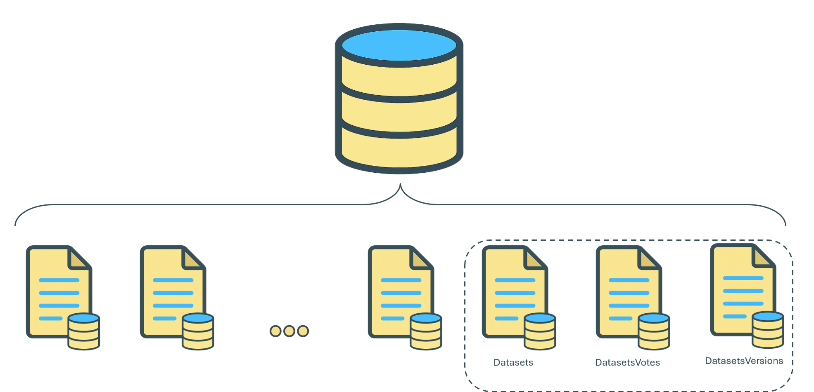
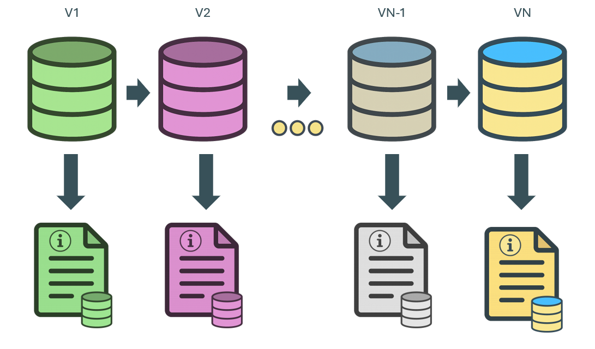
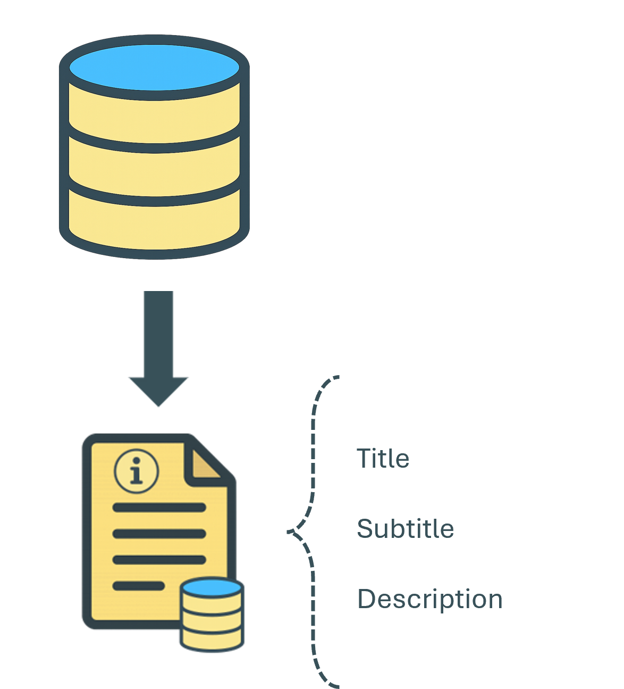
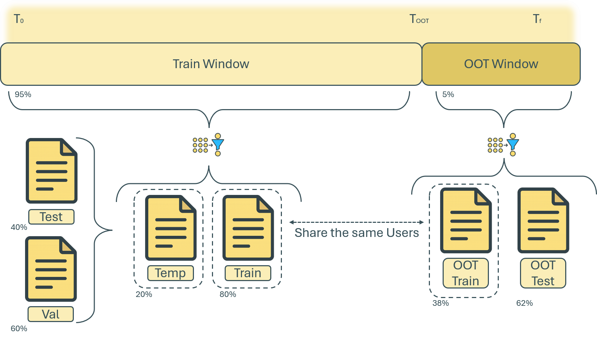
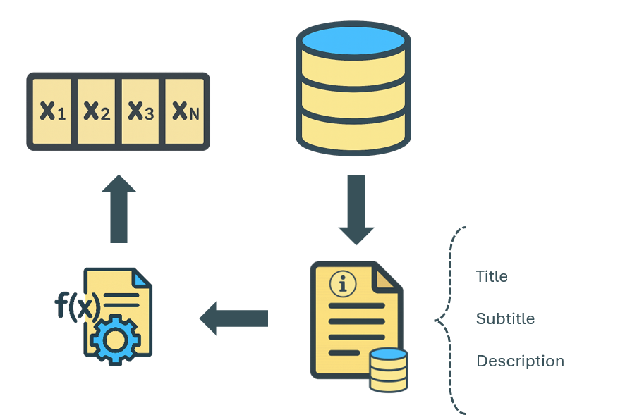

# K-DATARECO

# Dataset Recommendation through DOC2VEC

## Objective: 

This notebook explores the feasibility of building a recommendation system for Kaggle Datasets and Users, leveraging the upvote behavior captured in the Meta Kaggle DatasetVotes dataset.

The primary goal is to investigate whether we can generate meaningful suggestions by analyzing user-dataset interactions. Specifically, the system aims to answer two types of recommendation prompts:

- People who liked this dataset also liked...
    - Recommending additional datasets based on the collective preferences of users who upvoted similar datasets.
- You might want to connect with this user...
    - Identifying users with similar interests, based on overlapping voting behavior, to encourage collaboration, learning, or networking.

These recommendations can help:

- Users discover new datasets tailored to their interests.
- Foster community engagement by highlighting like-minded individuals.


## Code

### Imports


```python
# Data manipulation and analysis
import pandas as pd
import numpy as np
from scipy.stats import gaussian_kde

# Faster data operations
import swifter

# Natural Language Processing
import nltk
from nltk.tokenize import word_tokenize

# Document embeddings
from gensim.models.doc2vec import Doc2Vec, TaggedDocument
import gensim

# Visualization
import matplotlib.pyplot as plt

# Recommendation system utilities
from sklearn.metrics.pairwise import cosine_similarity
from sklearn.neighbors import NearestNeighbors

# Model utils
from sklearn.model_selection import train_test_split

# Saving utils
import pickle

# System and display
import warnings
import os
from typing import Optional

```

### Config


```python
warnings.filterwarnings('ignore')
nltk.download('punkt_tab')
```

    [nltk_data] Downloading package punkt_tab to
    [nltk_data]     /home/dhdzmota/nltk_data...
    [nltk_data]   Package punkt_tab is already up-to-date!


    True


### Constants


```python
MODEL_FILEPATH = '../models/doc2vec_model.pkl'

save_data = False
OOT_DATE = '2025-01-01'
RANDOM_SEED = 42
VOTES_THRESHOLD = 5
COMPARISON_THRESHOLD = 0.75
OVERWRITE = False
```

### Read data 

We focused our analysis on three interrelated Kaggle data sources that capture key aspects of dataset publication and interaction within the platform. From the wide range of available tables, we narrowed our scope to those specifically centered on Kaggle Datasets and their usage.



We are working with the following csv files: 

- `archive/DatasetVotes.csv`
- `archive/Datasets.csv`
- `archive/DatasetVersions.csv`

These datasets allow us to explore:

- How datasets are created, owned, and evolved.
- How users interact with datasets via votes.
- How different versions of datasets are managed over time.
---

#### 1. `DatasetVotes`: Core Dataset

This file captures the user engagement with each _dataset_ by tracking votes casted on dataset versions. The main idea is that there is a user-dataset interaction: each user can upvote multiple _datasets_, and each _dataset_ can receive upvotes from multiple users—highlighting a many-to-many relationship between users and _datasets_.


#### 2. `Datasets`: 

This file contains high-level information about each _dataset_ on Kaggle. It basically tracks authorship and ownership, usage statistics, and describes the dataset's nature and lifecycle.


#### 3. `DatasetVersions`: 

This file tracks each version of a dataset, its description, and title changes over time. This is the main source of information regarding the content of a dataset. 



#### External Dataset Integration: UCI Machine Learning Repository

In addition to Kaggle datasets, we incorporated data from the UC Irvine Machine Learning Repository to enrich our understanding of dataset content and improve the model’s ability to generalize. To achieve this, we web-scraped the repository, extracting key metadata fields: title, subtitle, and a brief description, which were structured to align with the Kaggle dataset format. 

The resulting information was stored as a Parquet file for efficient access and processing. This external data introduces diverse linguistic patterns and topic variations, ultimately supporting a more robust recommendation system.


```python
# Load core datasets
df_datasets = pd.read_csv('../data/archive/Datasets.csv')
df_dataset_votes = pd.read_csv('../data/archive/DatasetVotes.csv')
df_dataset_versions = pd.read_csv('../data/archive/DatasetVersions.csv')

# External
df_external_data = pd.read_parquet('../data/external/UC_Irvine_ML_Repo.parquet')
```


```python
# Load complementary datasets
df_users = pd.read_csv('../data/archive/Users.csv')
df_users_followers = pd.read_csv('../data/archive/UserFollowers.csv')
```

### Functions


```python
def create_user_dataset_relation(df_versions: pd.DataFrame, df_votes: pd.DataFrame) -> pd.DataFrame:
    """
    Create a user-dataset relationship DataFrame by merging DatasetVersions and DatasetVotes.

    Parameters:
    - df_versions (pd.DataFrame): The DatasetVersions DataFrame.
    - df_votes (pd.DataFrame): The DatasetVotes DataFrame.

    Returns:
    - pd.DataFrame: A DataFrame containing DatasetId, CreationDate, UserId, and VoteDate.
    """
    # Rename for clarity and merge
    user_dataset_relation = df_versions.rename(
        columns={'Id': 'DatasetVersionId'}
    )[['DatasetVersionId', 'DatasetId', 'CreationDate']].merge(
        df_votes[['DatasetVersionId', 'UserId', 'VoteDate']],
        on='DatasetVersionId',
        how='right'
    ).drop('DatasetVersionId', axis=1)
    return user_dataset_relation

def create_simplified_dataset(df_datasets: pd.DataFrame, verbose: bool = False) -> pd.DataFrame:
    """
    Create a simplified dataset-user mapping by combining CreatorUserId and OwnerUserId.

    Parameters:
    - df_datasets (pd.DataFrame): The Datasets DataFrame from Meta Kaggle.
    - verbose (bool): Whether to print info about the output DataFrame.

    Returns:
    - pd.DataFrame: A DataFrame with columns ['DatasetId', 'UserId'].
    """
    # Select and rename relevant columns
    simplified = df_datasets[['CreatorUserId', 'OwnerUserId', 'Id']].rename(columns={'Id': 'DatasetId'})
    
    # Combine user fields into a list and explode
    simplified['UserId'] = simplified[['CreatorUserId', 'OwnerUserId']].values.tolist()
    simplified = simplified[['DatasetId', 'UserId']].explode('UserId').dropna()

    # Cast types and drop duplicates
    simplified = simplified.astype({'DatasetId': int, 'UserId': int}).drop_duplicates()
    if verbose:
        print(f"Simplified dataset created. Shape: {simplified.shape}")

    return simplified

def add_user_dataset_identifier(df: pd.DataFrame,
                                dataset_col: str = 'DatasetId',
                                user_col: str = 'UserId',
                                inplace: bool = False) -> pd.DataFrame:
    """
    Adds a combined identifier column (e.g., 'UserId_DatasetId') to a DataFrame.

    Parameters:
    - df (pd.DataFrame): The input DataFrame.
    - dataset_col (str): Name of the dataset ID column. Default is 'DatasetId'.
    - user_col (str): Name of the user ID column. Default is 'UserId'.
    - inplace (bool): Whether to modify the original DataFrame in place.

    Returns:
    - pd.DataFrame: DataFrame with the new identifier column.
    """
    if not inplace:
        df = df.copy()
    new_col = f'{user_col}_{dataset_col}'
    df[new_col] = df[dataset_col].astype(str) + '_' + df[user_col].astype(str)

    return df

def remove_autolikes(user_dataset_df: pd.DataFrame,
                     simplified_dataset_df: pd.DataFrame,
                     id_col: str = 'UserId_DatasetId') -> pd.DataFrame:
    """
    Removes autolikes from the user-dataset interaction DataFrame.
    Autolikes are defined as likes made by the dataset's creator or owner.

    Parameters:
    - user_dataset_df (pd.DataFrame): DataFrame with user-dataset interactions.
    - simplified_dataset_df (pd.DataFrame): DataFrame containing known autolikes based on ownership.
    - id_col (str): Column used to identify user-dataset pairs (default: 'UserId_DatasetId').

    Returns:
    - pd.DataFrame: Filtered DataFrame without autolikes.
    """
    # Ensure copy to avoid modifying original data
    filtered_df = user_dataset_df[~user_dataset_df[id_col].isin(simplified_dataset_df[id_col])].copy()
    
    return filtered_df


def convert_date_to_datetime(df: pd.DataFrame, column: str = 'CreationDate',) -> pd.DataFrame:
    """
    Converts the specified column in a DataFrame to datetime format.

    Parameters:
    - df (pd.DataFrame): The input DataFrame.
    - column (str): The name of the column to convert. Default is 'CreationDate'.

    Returns:
    - pd.DataFrame: DataFrame with the converted datetime column.
    """
    if column not in df.columns:
        raise ValueError(f"Column '{column}' not found in DataFrame.")

    df[column] = pd.to_datetime(df[column], errors='coerce')
    return df

def split_user_dataset_by_date(df: pd.DataFrame,
                                date_col: str = 'CreationDate',
                                oot_date: str = '2025-01-01',
                                verbose: bool = True) -> tuple[pd.DataFrame, pd.DataFrame]:
    """
    Splits a user-dataset interaction DataFrame into training and OOT sets based on a given date.

    Parameters:
    - df (pd.DataFrame): The input DataFrame containing the date column.
    - date_col (str): The column name to use for the date filter (default: 'CreationDate').
    - oot_date (str): The out-of-time cutoff date (YYYY-MM-DD format or similar).
    - verbose (bool): Whether to print information about the split.

    Returns:
    - Tuple[pd.DataFrame, pd.DataFrame]: (training_set, oot_set)
    """
    oot_datetime = pd.to_datetime(oot_date)

    df_oot = df[df[date_col] >= oot_datetime].copy()
    df_train = df[df[date_col] < oot_datetime].copy()

    if verbose:
        print(f"Split complete using OOT date: {oot_datetime.date()}")
        print(f"📦 Training set: {df_train.shape[0]} rows")
        print(f"📦 OOT set: {df_oot.shape[0]} rows")

    return df_train, df_oot

def plotting_votes(df: pd.DataFrame,
                      date_col: str = 'VoteDate',
                      title: str = 'Monthly Vote Activity',
                      color: str = 'darkred',
                      alpha: str = 1, 
                      periodicity='M',
                      figsize: tuple = (12, 5),
                  ) -> None:
    """
    Plots the number of rows per month using the specified date column
    to help visually identify outliers or trends.

    Parameters:
    - df (pd.DataFrame): The input DataFrame.
    - date_col (str): The column with datetime values (default: 'VoteDate').
    - title (str): Plot title.
    - color (str): Line color for the plot.
    - figsize (tuple): Size of the figure.
    """
    # Group by month and plot
    grouper = pd.Grouper(key=date_col, freq=periodicity)
    monthly_counts = df.groupby(grouper).size()

    plt.figure(figsize=figsize)
    monthly_counts.plot(color=color, alpha=alpha)
    plt.title(title)
    plt.xlabel(f'Month ({date_col})')
    plt.ylabel('Number of Votes')
    plt.grid(True)
    plt.tight_layout()

def filter_users_by_vote_threshold(df: pd.DataFrame,
                                   user_col: str = 'UserId',
                                   threshold: int = 5,
                                   verbose: bool = True) -> pd.Index:
    """
    Returns user IDs that appear at least 'threshold' times in the DataFrame.

    Parameters:
    - df (pd.DataFrame): DataFrame containing user interactions.
    - user_col (str): Name of the column with user IDs.
    - threshold (int): Minimum number of votes required to keep the user.
    - verbose (bool): Whether to print the number of users retained.

    Returns:
    - pd.Index: Index of user IDs that meet or exceed the threshold.
    """
    vote_counts = df[user_col].value_counts()
    usable_users = vote_counts[vote_counts >= threshold].index

    if verbose:
        print(f"{len(usable_users)} users retained with ≥ {threshold} votes.")

    return usable_users

def split_users(user_ids: pd.Index,
                train_size: float = 0.8,
                test_size: float = 0.6,
                random_state: int = 42,
                verbose: bool = True) -> [pd.Index, pd.Index, pd.Index]:
    """
    Splits a list or index of user IDs into train, test, and validation subsets.

    Parameters:
    - user_ids (pd.Index or list): User IDs to split.
    - train_size (float): Proportion of users for the training set (default: 0.8).
    - test_size (float): Proportion of remaining users assigned to the test set (default: 0.6).
    - random_state (int): Random seed for reproducibility.
    - verbose (bool): Whether to print the size of each split.

    Returns:
    - Tuple of pd.Index: (train_users, test_users, val_users)
    """
    # First split: train vs rest
    train_users, rest_users = train_test_split(user_ids, train_size=train_size, random_state=random_state)
    
    # Second split: test vs validation from rest
    test_users, val_users = train_test_split(rest_users, train_size=test_size, random_state=random_state)

    if verbose:
        print(f"User split complete:")
        print(f"   • Train users: {len(train_users)}")
        print(f"   • Test users: {len(test_users)}")
        print(f"   • Validation users: {len(val_users)}")

    return train_users, test_users, val_users

def treatment_function(user_dataset_relation_df: pd.DataFrame) -> pd.DataFrame:
    """
    Creates rolling lists of datasets voted on by users in chronological order.

    This function is designed to generate N-sequence patterns of dataset interactions,
    which can be useful for sequence-based recommendation models.

    Steps:
    1. Sorts the input DataFrame by 'VoteDate'.
    2. For each row, creates a list of the current DatasetId and the N previous ones.
    3. Filters out rows where any of the three dataset IDs are missing (represented by 0).
    4. Returns a simplified DataFrame with the vote timestamp and the triplet of dataset IDs.

    Parameters:
    - user_dataset_relation_df (pd.DataFrame): DataFrame with at least 'VoteDate' and 'DatasetId' columns.

    Returns:
    - pd.DataFrame: A DataFrame with columns:
        • 'VoteDate': Timestamp of the current vote.
        • 'dataset_id': List containing [..., DatasetId_t-2, DatasetId_t-1, DatasetId_t]
          where t is the current row, representing a rolling interaction window.
    """
    # Step 1: Sort by vote timestamp
    sorted_df = user_dataset_relation_df.sort_values('VoteDate')

    # Step 2: Create rolling dataset triplets
    dataset_ids_threshold = []
    for nb_count in range(VOTES_THRESHOLD-1):
        col = f'DatasetId{nb_count+1}'
        dataset_ids_threshold.append(col)
        sorted_df[col] = sorted_df['DatasetId'].shift(nb_count+1).fillna(0).astype(int)
    sorted_df['dataset_id'] = sorted_df[['DatasetId'] + dataset_ids_threshold].values.tolist()

    # Step 3: Remove triplets that contain a placeholder (0) from padding
    filtered_df = sorted_df[~sorted_df['dataset_id'].apply(lambda x: 0 in x)]

    # Step 4: Keep only the necessary columns
    final_df = filtered_df[['VoteDate', 'dataset_id']]

    return final_df

def check_if_file_exists(filepath: str) -> bool:
    """
    Checks whether a file exists at the given path.

    Parameters:
    - filepath (str): The path to the file.
    Returns:
    - bool: True if the file exists, False otherwise.
    """
    exists = os.path.exists(filepath)
    
    return exists

def save_pickle_model(model_object, filepath: str, verbose: bool = True) -> None:
    """
    Saves a Python object (e.g., a model) to disk using pickle.

    Parameters:
    - model_object: The object to save (e.g., trained model).
    - filepath (str): File path where the object will be saved.
    - verbose (bool): If True, prints a success message.

    Returns:
    - None
    """
    with open(filepath, 'wb') as f:
        pickle.dump(model_object, f)
    if verbose:
        print(f"💾 Model successfully saved to: {filepath}")

def load_pickle_model(filepath: str, verbose: bool = True):
    """
    Loads a Python object from a pickle file.

    Parameters:
    - filepath (str): Path to the pickle file.
    - verbose (bool): If True, prints status messages.

    Returns:
    - The loaded Python object.

    Raises:
    - FileNotFoundError: If the file does not exist.
    - Exception: For any other loading issues.
    """
    with open(filepath, 'rb') as f:
        model = pickle.load(f)
    if verbose:
        print(f"✅ Model successfully loaded from: {filepath}")
    return model

def infer_vector_from_doc(doc: str, model: Optional[Doc2Vec] = None) -> Optional[np.ndarray]:
    """
    Infers a document vector from raw text using a trained Doc2Vec model.

    Parameters:
    - doc (str): Input document as a raw string.
    - model (Doc2Vec, optional): A trained Gensim Doc2Vec model.

    Returns:
    - np.ndarray or None: The inferred vector if successful, otherwise None.
    """
    if model is not None:
        tokens = word_tokenize(doc.lower())
        vector = model.infer_vector(tokens)
        return vector
    return None

def save_parquet_file(df: pd.DataFrame,
                      set_name: str = 'train',
                      output_dir: str = './',
                      verbose: bool = True) -> None:
    """
    Saves a given DataFrame to a Parquet file with the specified set name.

    Parameters:
    - df (pd.DataFrame): The DataFrame to save.
    - set_name (str): A name indicating the purpose of the file (e.g., 'train', 'test').
    - output_dir (str): Directory where the file will be saved.
    - verbose (bool): If True, prints confirmation of the saved file.

    Returns:
    - None
    """
    # Construct file path
    filepath = os.path.join(output_dir, f"{set_name}.parquet")
    # Save file
    df.to_parquet(filepath)

    if verbose:
        print(f"💾 File saved as: {filepath}")

def plot_ridgeline(df, group_col, value_col,
                               bandwidth=0.02,
                               figsize=(10, 6),
                               alpha=0.6,
                               spacing=1.0,
                               ylabel='',
                               color='darkred',
                               title='Ridgeline Plot'):
    """
    Creates a ridgeline (stacked KDE) plot using only matplotlib.

    Parameters:
    - df (pd.DataFrame): Input DataFrame.
    - group_col (str): Column to group by (e.g. 'jaccard_distance').
    - value_col (str): Column with values to plot (e.g. 'cos_similarity').
    - bandwidth (float): Smoothing bandwidth for KDE.
    - figsize (tuple): Size of the figure.
    - alpha (float): Transparency of each curve.
    - spacing (float): Vertical offset between curves.
    - color (str): Color of the KDE curves.
    - title (str): Title of the plot.
    """
    plt.figure(figsize=figsize)

    unique_groups = sorted(df[group_col].dropna().unique(), reverse=True)
    x_grid = np.linspace(0, 1, 100)

    for i, group in enumerate(unique_groups):
        data = df[df[group_col] == group][value_col].dropna()
        kde = gaussian_kde(data, bw_method=bandwidth)
        y = kde(x_grid)
        y = y / y.max()  # Normalize
        offset = i * spacing
        plt.fill_between(x_grid, y + offset, offset, alpha=alpha, color=color)
        plt.text(1.01, offset, str(group), va='center', fontsize=9)

    plt.title(title)
    plt.xlabel(value_col)
    plt.yticks([])
    plt.ylabel(ylabel)
    plt.grid(axis='x', linestyle='--', alpha=0.5)
    plt.tight_layout()
    plt.show()

def jaccard_distance_df(df) -> float:
    """
    Calculates the Jaccard-based overlap ratio between two sets of dataset IDs.

    This function computes the intersection size between two lists of dataset IDs 
    contained in the DataFrame columns `dataset_id_initial` and `dataset_id_compare`, 
    and returns the normalized overlap ratio.

    Parameters:
    - df (pd.DataFrame): A DataFrame containing two columns:
        • 'dataset_id_initial': First list of dataset IDs.
        • 'dataset_id_compare': Second list of dataset IDs.

    Returns:
    - float: The overlap ratio, defined as:
             |A ∩ B| / (|A| + |B|)
             where A and B are the two sets of dataset IDs.
    """
    a = df.dataset_id_initial
    b = df.dataset_id_compare
    len_a = len(a)
    len_b = len(b)
    len_intersection = len(set(a).intersection(set(b)))
    distance = len_intersection/(len_a + len_b)
    return distance

def compare_similarity_sets(initial_data: pd.DataFrame,
                            compare_data: pd.DataFrame,
                            sample_frac: float = 0.1) -> pd.DataFrame:
    """
    Compares a sample of dataset embeddings from one DataFrame to all embeddings in another,
    computing cosine similarity and Jaccard-based overlap between matched sets.

    For each sampled row in `initial_data`, this function:
    - Computes the cosine similarity with every embedding in `compare_data`.
    - Identifies the most similar dataset (highest cosine similarity).
    - Extracts both dataset ID lists (initial and matched).
    - Calculates a custom Jaccard-based intersection score.
    - Returns a summary DataFrame with similarity and overlap results.

    Parameters:
    - initial_data (pd.DataFrame): DataFrame with columns:
        • 'embeddings': A vector or array-like object.
        • 'dataset_id': A list of dataset identifiers.
    - compare_data (pd.DataFrame): Same structure as `initial_data`, used for comparison.
    - sample_frac (float): Fraction of rows to sample from `initial_data` for comparison.

    Returns:
    - pd.DataFrame: DataFrame with the following columns:
        • 'id_max_test': Index of the most similar dataset in `compare_data`.
        • 'dataset_id_initial': List of dataset IDs from the sampled `initial_data` row.
        • 'dataset_id_compare': List of dataset IDs from the best match in `compare_data`.
        • 'cos_similarity': Maximum cosine similarity value.
        • 'jaccard_distance': Overlap ratio between both dataset ID lists.
    """
    results = {}
    for row in initial_data.sample(frac=sample_frac, random_state=RANDOM_SEED).iterrows():
        index, row_characteristics = row
        t = compare_data.embeddings.apply(lambda x: (x * row_characteristics.embeddings).sum()).sort_values()
        results[index] = t
    results_df = pd.DataFrame(results)
    results_answers = pd.DataFrame()
    results_answers['id_max_test'] = results_df.idxmax()
    results_answers['dataset_id_initial'] = initial_data.loc[results_df.columns].dataset_id
    results_answers['dataset_id_compare'] = compare_data.loc[results_df.idxmax().to_list()].dataset_id.to_list()
    results_answers['cos_similarity'] = results_df.max()
    results_answers['jaccard_distance'] = results_answers.apply(jaccard_distance_df, axis=1)
    return results_answers
```

### Pre-Process data

The preparation of our dataset for modeling involves four consecutive preprocessing actions, each designed to improve data quality, fairness, and relevance. While each step is explained in detail in the following sections, the entire process is summarized visually in the image below:


a) Join Users and Datasets via Votes

b) Remove Auto-Likes (Self-Upvotes)

c) Detect and Remove Voting Outliers

d) Filter for Recent Datasets (from 2020 onward)

---


#### a) Joining Users and Datasets via Votes

To analyze user-dataset interactions, we need to connect users with the datasets they've upvoted. However, the df_dataset_votes table records votes at the version level, not directly at the dataset level. To bridge this, we use df_dataset_versions, which maps each version to its corresponding dataset.

In this analysis, we make the simplifying assumption that each vote corresponds to the latest version of the dataset. While a more accurate approach would align votes with the dataset version closest in time, this simplification allows us to focus on broader engagement patterns without complex temporal alignment.
```
Note: This is a trade-off between accuracy and practicality. Future iterations could refine this by matching vote timestamps to the nearest version date.
```


```python
user_dataset_relation = create_user_dataset_relation(
    df_versions=df_dataset_versions, df_votes=df_dataset_votes
)
```


```python
simplified_dataset = create_simplified_dataset(df_datasets, verbose=True)
```

    Simplified dataset created. Shape: (489863, 2)


```python
simplified_dataset = add_user_dataset_identifier(simplified_dataset)
user_dataset_relation = add_user_dataset_identifier(user_dataset_relation)
```

#### b) Remove Auto-Likes (Self-Upvotes)

Another important preprocessing step is filtering out auto-likes, or self-upvotes. These occur when the creator or owner of a dataset upvotes their own work — a form of artificial inflation that can bias our analysis.

To address this:
- Each dataset includes a CreatorUserId and an OwnerUserId.
- We remove any vote where the UserId (the one who voted) matches either the CreatorUserId or OwnerUserId of the corresponding dataset.

By excluding these self-upvotes, we ensure that the engagement metrics better reflect organic community interaction, rather than actions taken by the dataset authors themselves.


```python
user_dataset_relation = remove_autolikes(user_dataset_relation, simplified_dataset)
```


```python
user_dataset_relation = convert_date_to_datetime(user_dataset_relation, column='CreationDate')
user_dataset_relation = convert_date_to_datetime(user_dataset_relation, column='VoteDate')
```

#### c) Detecting and Removing Voting Outliers

To ensure that our analysis reflects genuine engagement, we need to address the presence of outlier users: those whose voting behavior appears unnatural or automated.

We consider two types of outliers:

1. High-Volume Voters
Some users upvote an abnormally large number of datasets. While most users upvote just one, a few have voted on over 100,000 datasets, which strongly suggests automated or non-organic behavior.

2. High-Speed Voters
Beyond volume, some users vote at unrealistically high speeds (Users with a high number of votes over a short period (e.g., hundreds per hour or more) are likely automated). For this, we calculate the vote rate by analyzing:
    - The total number of upvotes.
    - The time span between their first and last recorded upvote.


##### Strategy: 
We define a threshold (e.g., the 99.975th percentile as a hard cutoff) and exclude users who have upvoted more datasets than that threshold in both speed and high volume. 

By filtering out both high-volume and high-speed voters, we ensure that the remaining data better represents authentic, human interactions with datasets.


```python
plotting_votes(user_dataset_relation)
```


    

    


```python
user_votes_speed = user_dataset_relation.groupby('UserId').agg(
    vote_date_max=('VoteDate', 'max'),
    vote_date_min=('VoteDate', 'min'),
    vote_count=('VoteDate', 'count')
)
count_of_votes = user_dataset_relation.UserId.value_counts()
speed_of_votes = (user_votes_speed.vote_count/((user_votes_speed.vote_date_max-user_votes_speed.vote_date_min).dt.days+1)).sort_values(ascending=False)
```


```python
# Based on the intersection speed of the votes and the amount of votes given a quantile, outliers were taken out. 
quantile = 0.99975
outliers = speed_of_votes.loc[
    list(
        set(count_of_votes[count_of_votes>count_of_votes.quantile(quantile)].index).intersection(
            set(speed_of_votes[speed_of_votes>speed_of_votes.quantile(quantile)].index)
        )
    )
].index
```


```python
# Finding outliers:
user_dataset_relation_outlier = user_dataset_relation[(user_dataset_relation.UserId.isin(outliers))]
user_dataset_relation = user_dataset_relation[~(user_dataset_relation.UserId.isin(outliers))]
```


```python
plotting_votes(user_dataset_relation_outlier, alpha=0.5, periodicity='M')
plotting_votes(user_dataset_relation, alpha=1)
```


    

    


    

    


```python
#plotting_votes(user_dataset_relation, date_col='CreationDate', color='darkblue', title='Monthly Dataset (must be voted) Creation')
```

#### d) Filtering for Recent Datasets

To ensure our analysis and recommendations reflect current trends and data usage patterns, we limit our scope to datasets created from 2020 onward.

This temporal filtering helps:
- Maintain relevance with respect to modern data practices and topics.
- Avoid outdated datasets that may no longer be available, supported, or used.
- Reduce noise from legacy content with inconsistent metadata formats.


```python
user_dataset_relation = user_dataset_relation[user_dataset_relation.CreationDate >= pd.to_datetime('2020-01-01')]
```


```python
plotting_votes(user_dataset_relation)
plotting_votes(user_dataset_relation, date_col='CreationDate', color='darkblue', title='Monthly Dataset (must be voted) Creation')
```


    

    


    

    


### Additional Process

In addition to the core dataset preparation, several auxiliary components of the project require preprocessing to ensure data usability and consistency. These steps, while independent from the primary modeling pipeline, are essential for enriching the dataset and facilitating later stages of analysis. This section outlines the processing of key supporting elements: defining documents used for semantic modeling, reducing the size and complexity of the dataset_versions table, summarizing user-follow relationships, and refining user profile information. Each step enhances the structure and relevance of the available data, contributing to a more streamlined and effective modeling workflow.

#### Definition of a Document

For the purpose of this recommendation system, we define a document as the textual representation of a dataset based on its core descriptive fields. Specifically, each document is constructed using the following:

- `Title`: The main name of the dataset.
- `Subtitle`: A brief complementary description, often used to add context or highlight use cases.
- `Description`: A more detailed explanation of the dataset’s content, structure, and intended purpose.




These three fields are concatenated to form a single text unit that serves as the semantic representation of the dataset. This approach enables us to capture the internal linguistic structure and thematic relationships between words and phrases, which are crucial for modeling dataset similarity and relevance in a content-based recommendation system.

This document definition is foundational for later stages.


```python
# Lets get a intial treatment of the dataset versions
df_dataset_versions['TotalDescription'] = (
    df_dataset_versions.Title.fillna('') + ' ' + 
    df_dataset_versions.Subtitle.fillna('') + ' ' +
    df_dataset_versions.Description.fillna('') 
)
```

#### Reduction of the dataset_versions dataset

To streamline our processing and avoid redundancy, we reduce the df_dataset_versions table to keep only the most recent version for each dataset.

This reduced version simplifies subsequent joins and ensures consistency across the pipeline.


```python
reduced_dataset_versions = df_dataset_versions.sort_values(
    'VersionNumber'
).drop_duplicates(
    'DatasetId', keep='last'
).set_index(
    'DatasetId'
)[['CreatorUserId', 'Title']]
if save_data:
    reduced_dataset_versions.to_parquet('../data/processed/reduced_dataset_versions.parquet')
```

#### Reduction of the user_followers dataset
To simplify the structure of the df_users_followers dataset and prepare it for efficient lookup and analysis, we aggregate the list of users each indivual.

The resulting table maps each user to a list of users they follow, enabling fast access to user social graph information for later modeling or filtering.


```python
df_users_followers_reduced = df_users_followers.groupby('UserId').FollowingUserId.apply(list)
if save_data:
    df_users_followers_reduced.reset_index().to_parquet('../data/processed/reduced_user_followers.parquet')
```

#### Reduction of the user dataset
To retain only essential user identity information, we reduce the df_users DataFrame to a minimal set of fields.
This reduced user table is used primarily for joining, display, and traceability in recommendation outputs or user-centric analysis.


```python
if save_data:
    df_users.rename(columns={'Id': 'UserId'})[['UserId', 'UserName', 'DisplayName']].to_parquet('../data/processed/reduced_user.parquet')
```

### Data splitting

The data splitting process is conducted at the UserId level to preserve user-specific interaction histories and avoid data leakage. It follows a sequential structure with three main steps:

- Temporal Holdout: defined as a time-based cutoff. All dataset interactions occurring before a certain date are considered eligible for training. Interactions after this date form an out-of-time (OOT) holdout set for future evaluation, ensuring the model is not exposed to future data during training.

- User Selection Criteria
To ensure meaningful engagement histories, we retain only users who have upvoted at least 5 different datasets. This filters out sparse activity and allows for more robust modeling.

- Train/Test/Validation Split
From the filtered users within the training period, we randomly split.

Each of these steps is described in detail in the sections that follow. Together, they form a consistent and realistic strategy for preparing data in a way that respects time, behavior quality, and evaluation integrity.





#### Temporal Holdout

To ensure consistency with a realistic evaluation setting, we perform a time-based data split. This helps simulate a real-world scenario where future data is unknown at training time.

- Training Window:
From `2020-01-01` to `2025-01-01` (inclusive).
This 5-year span represents the data available during the system’s training phase.

- Out-of-Time (OOT) Evaluation Window:
From `2025-01-01` onward.
This portion is reserved for testing and evaluation, simulating how the system performs on unseen, future datasets.

This approach ensures:
- No data leakage from future to past.
- Fair assessment of generalization capabilities.
- Chronological integrity, which is especially important in recommendation systems where content freshness and recency matter.


```python
user_dataset_relation_t, user_dataset_relation_oot = split_user_dataset_by_date(
    user_dataset_relation, oot_date=OOT_DATE
)
```

    Split complete using OOT date: 2025-01-01
    📦 Training set: 1359910 rows
    📦 OOT set: 55163 rows


```python
if save_data:
    user_dataset_relation_t.to_parquet('../data/processed/UserDataset_relation_t.parquet')
    user_dataset_relation_oot.to_parquet('../data/processed/UserDataset_relation_oot.parquet')
```

#### User Selection Criteria

We apply a user filtering rule to ensure fairness and meaningful participation: 

__Only users who have upvoted at least 5 different datasets are included in the analysis.__


This criterion helps us:
- Eliminate accounts with minimal activity (e.g., 1,2, 3 and 4 upvotes), which may introduce noise.
- Focus on users with a more representative engagement history.
- Make fairer evaluations when assessing recommendations across users.


```python
# We apply the votes threshold for each users.
actual_usable_users = filter_users_by_vote_threshold(
    user_dataset_relation_t, threshold=VOTES_THRESHOLD
)

actual_usable_users_oot = filter_users_by_vote_threshold(
    user_dataset_relation_oot, threshold=VOTES_THRESHOLD
)
```

    23739 users retained with ≥ 5 votes.
    1183 users retained with ≥ 5 votes.


#### Random Split for Train Window

To effectively evaluate and refine our model's performance, we adopted a systematic user-based data splitting approach, ensuring that no user appears in more than one split. This helps preserve the integrity of our evaluation process.


- **Training Set** (80%)
80% of the eligible users were randomly assigned to the training set. This subset is used to build and optimize the model.

- **Validation Set** (12%)
60% of the remaining 20% was allocated to validation. This set is used during development to tune model hyperparameters and prevent overfitting.

- **Test Set** (8%)
The final 40% of the 20% holdout is reserved for final evaluation, ensuring an unbiased measure of model performance.

By performing random user-based splits, we avoid data leakage across sets while creating a robust and generalizable training environment. This strategy also enables fair benchmarking across different modeling strategies and evaluation rounds.


```python
train_users, test_users, val_users = split_users(actual_usable_users, random_state=RANDOM_SEED)
```

    User split complete:
       • Train users: 18991
       • Test users: 2848
       • Validation users: 1900


```python
# Current datasets
user_dataset_relation_t__train = user_dataset_relation_t[user_dataset_relation_t.UserId.isin(train_users)]
user_dataset_relation_t__test = user_dataset_relation_t[user_dataset_relation_t.UserId.isin(test_users)]
user_dataset_relation_t__val = user_dataset_relation_t[user_dataset_relation_t.UserId.isin(val_users)]

# Future datsets
user_dataset_relation_oot__train = user_dataset_relation_oot[
    (user_dataset_relation_oot.UserId.isin(train_users)) & 
    (user_dataset_relation_oot.UserId.isin(actual_usable_users_oot))
]
user_dataset_relation_oot__test = user_dataset_relation_oot[
    (~user_dataset_relation_oot.UserId.isin(train_users)) & 
    (user_dataset_relation_oot.UserId.isin(actual_usable_users_oot))
]
```

### Data Preparation

To effectively analyze user behavior and prepare the data for a recommender system, we process historical upvote data into a structured, time-aware format. This enables the model to learn sequential usage patterns across datasets.

We begin by sorting the dataset by the VoteDate column to maintain a chronological order of user interactions.

For each user, we build rolling interaction windows of size 5:
- The first 4 entries are treated as historical context (previously upvoted datasets).
- The 5th entry is the current dataset being upvoted.

Any sequence where fewer than 5 prior datasets are available is excluded to ensure consistency and completeness in training data.

The resulting DataFrame contains:
- The VoteDate (timestamp of the current upvote),
- The 5 historical DatasetIds (used as input),

 Note: A single user may contribute multiple sequences over time. Each sequence is independent, even if they come from the same user, allowing for rich temporal modeling.


```python
agg__user_dataset_relation_t__train = user_dataset_relation_t__train.groupby('UserId').apply(treatment_function)
agg__user_dataset_relation_t__test = user_dataset_relation_t__test.groupby('UserId').apply(treatment_function)
agg__user_dataset_relation_t__val = user_dataset_relation_t__val.groupby('UserId').apply(treatment_function)
agg__user_dataset_relation_oot__train = user_dataset_relation_oot__train.groupby('UserId').apply(treatment_function)
agg__user_dataset_relation_oot__test = user_dataset_relation_oot__test.groupby('UserId').apply(treatment_function)
```


```python
all_train_dataset_ids = agg__user_dataset_relation_t__train.reset_index().drop('level_1', axis=1).explode('dataset_id').dataset_id.unique()
all_test_dataset_ids = agg__user_dataset_relation_t__test.reset_index().drop('level_1', axis=1).explode('dataset_id').dataset_id.unique()
all_val_dataset_ids = agg__user_dataset_relation_t__val.reset_index().drop('level_1', axis=1).explode('dataset_id').dataset_id.unique()
all_oot_train_dataset_ids = agg__user_dataset_relation_oot__train.reset_index().drop('level_1', axis=1).explode('dataset_id').dataset_id.unique()
all_oot_test_dataset_ids = agg__user_dataset_relation_oot__test.reset_index().drop('level_1', axis=1).explode('dataset_id').dataset_id.unique()

```


```python
# These might appear in the training set
all_train_datasets = df_dataset_versions[df_dataset_versions.DatasetId.isin(all_train_dataset_ids)].sort_values('VersionNumber').groupby('DatasetId').TotalDescription.last()
# This is just for training the doc2vec model without duplicates
all_train_datasets_unique = all_train_datasets.drop_duplicates().dropna()
```


```python
# Test
all_test_datasets = df_dataset_versions[df_dataset_versions.DatasetId.isin(all_test_dataset_ids)].sort_values('VersionNumber').groupby('DatasetId').TotalDescription.last()
all_test_datasets_unique = all_test_datasets.drop_duplicates().dropna()

# Val
all_val_datasets = df_dataset_versions[df_dataset_versions.DatasetId.isin(all_val_dataset_ids)].sort_values('VersionNumber').groupby('DatasetId').TotalDescription.last()
all_val_datasets_unique = all_val_datasets.drop_duplicates().dropna()

# OOT Train
all_oot_train_datasets = df_dataset_versions[df_dataset_versions.DatasetId.isin(all_oot_train_dataset_ids)].sort_values('VersionNumber').groupby('DatasetId').TotalDescription.last()
all_oot_train_datasets_unique = all_oot_train_datasets.drop_duplicates().dropna()

# OOT Test
all_oot_test_datasets = df_dataset_versions[df_dataset_versions.DatasetId.isin(all_oot_test_dataset_ids)].sort_values('VersionNumber').groupby('DatasetId').TotalDescription.last()
all_oot_test_datasets_unique = all_oot_test_datasets.drop_duplicates().dropna()

```

### Model training

#### Training the Doc2Vec Model

Understanding user preferences and dataset relationships requires a way to represent dataset content numerically. To achieve this, we use Doc2Vec, a deep learning–based algorithm that converts textual documents into dense vector representations capturing semantic meaning.

We trained the Doc2Vec model using dataset documents from the user training set. As stated before, each document is a combination of the following fields:

- Title.
- Subtitle.
- Description.
  
This combined text serves as a rich source of semantic information about each dataset.


##### Model Parameters
a. **Vector Size (128)**: Dimensionality of the generated vectors. Higher values allow the model to capture more subtle relationships.

b. **Min Count (8)**: Words that appear fewer than 8 times are ignored, helping reduce noise and focus on meaningful terms.

c. **Epochs (50)**: The number of full passes through the training data. More epochs enable the model to learn complex patterns.


##### Model Training Workflow

1. **Tokenization**: Each document is split into words, following standard preprocessing (e.g., lowercasing, punctuation removal).


2. **Dataset Preparation**: The tokenized documents form
the input for training the Doc2Vec model.

3. **Model Training**: The model learns to associate each document with a fixed-length vector that captures its semantic essence.

4. **Model Application**: The trained Doc2Vec model is then
applied to each document of a set. Each document is individually transformed into a vector representation.



This representation allows for nuanced comparisons between datasets, forming the foundation for the recommender system’s ability to suggest relevant content based on textual similarity.

#### Merging External Data for Model Training

To slightly improve training quality and diversify the model’s exposure to dataset content, we merged the Kaggle dataset information with the external data from the UC Irvine Machine Learning Repository. This combined corpus offers a richer representation of dataset descriptions, allowing the model to learn more generalizable and semantically meaningful patterns. By integrating both sources before training, we enhance the model’s vocabulary coverage, contextual understanding, and ability to make informed recommendations across different dataset domains.


```python
all_train_datasets_unique_external = df_external_data.rename(columns={'Total Description': 'TotalDescription'}).TotalDescription
```


```python
all_train_datasets_unique_external_internal = pd.concat([all_train_datasets_unique_external,all_train_datasets_unique], axis=0)
```

#### Training


```python
if not check_if_file_exists(MODEL_FILEPATH) or OVERWRITE:
    tagged_data = [TaggedDocument(words=word_tokenize(doc.lower()), tags=[str(i)]) for i, doc in enumerate(all_train_datasets_unique_external_internal)]
    model = Doc2Vec(vector_size=128, min_count=8, epochs=50)
    model.random.seed(RANDOM_SEED)
    model.build_vocab(tagged_data)
    model.train(tagged_data, total_examples=model.corpus_count, epochs=model.epochs)
    save_pickle_model(model, MODEL_FILEPATH)
else:
    model = load_pickle_model(MODEL_FILEPATH)
```

    💾 Model successfully saved to: ../models/doc2vec_model.pkl


```python
# Now we can apply the model inference to all documents. 
all_train_datasets_embeddings = all_train_datasets.fillna('No description available.').swifter.apply(infer_vector_from_doc, model=model)
all_test_datasets_embeddings = all_test_datasets.fillna('No description available.').swifter.apply(infer_vector_from_doc, model=model)
all_val_datasets_embeddings = all_val_datasets.fillna('No description available.').swifter.apply(infer_vector_from_doc, model=model)
all_oot_train_datasets_embeddings = all_oot_train_datasets.fillna('No description available.').swifter.apply(infer_vector_from_doc, model=model)
all_oot_test_datasets_embeddings = all_oot_test_datasets.fillna('No description available.').swifter.apply(infer_vector_from_doc, model=model)
```


    Pandas Apply:   0%|          | 0/83828 [00:00<?, ?it/s]


    Pandas Apply:   0%|          | 0/25918 [00:00<?, ?it/s]


    Pandas Apply:   0%|          | 0/21243 [00:00<?, ?it/s]


    Pandas Apply:   0%|          | 0/3669 [00:00<?, ?it/s]


    Pandas Apply:   0%|          | 0/2733 [00:00<?, ?it/s]


#### Feature computation

Once all dataset documents in the training, validation, and test sets are transformed into vector representations using the trained Doc2Vec model, we can proceed to summarize user behavior.

Each user instance includes five historical datasets they previously upvoted. To capture the essence of a user's past preferences, we apply a simple yet effective aggregation technique:

We compute the mean of the five document normalized embeddings associated with each user instance.

This aggregation produces a single vector that serves as a representation of the user's recent interests and interactions, which can then be compared to candidate dataset vectors during recommendation.


In this case, the aggregation has the following perks:
- Simplicity: Easy to compute and interpret.
- Effectiveness: Averages the semantic signals across multiple documents.
- Order-Invariance: Assumes no temporal weighting (each historical dataset is treated equally).


```python
agg__user_dataset_relation_w_embeddings_t__train = agg__user_dataset_relation_t__train.dataset_id.explode().reset_index().merge(
    all_train_datasets_embeddings.apply(lambda x: x/np.linalg.norm(x)).reset_index(), 
    left_on='dataset_id',
    right_on='DatasetId', 
    how='left',
).groupby(['UserId','level_1']).TotalDescription.mean()
```


```python
agg__user_dataset_relation_w_embeddings_t__test = agg__user_dataset_relation_t__test.dataset_id.explode().reset_index().merge(
    all_test_datasets_embeddings.apply(lambda x: x/np.linalg.norm(x)).reset_index(), 
    left_on='dataset_id',
    right_on='DatasetId', 
    how='left',
).groupby(['UserId','level_1']).TotalDescription.mean()
```


```python
agg__user_dataset_relation_w_embeddings_t__val = agg__user_dataset_relation_t__val.dataset_id.explode().reset_index().merge(
    all_val_datasets_embeddings.apply(lambda x: x/np.linalg.norm(x)).reset_index(), 
    left_on='dataset_id',
    right_on='DatasetId', 
    how='left',
).groupby(['UserId','level_1']).TotalDescription.mean()
```


```python
agg__user_dataset_relation_w_embeddings_oot__train = agg__user_dataset_relation_oot__train.dataset_id.explode().reset_index().merge(
    all_oot_train_datasets_embeddings.apply(lambda x: x/np.linalg.norm(x)).reset_index(), 
    left_on='dataset_id',
    right_on='DatasetId', 
    how='left',
).groupby(['UserId','level_1']).TotalDescription.mean()
```


```python
agg__user_dataset_relation_w_embeddings_oot__test = agg__user_dataset_relation_oot__test.dataset_id.explode().reset_index().merge(
    all_oot_test_datasets_embeddings.apply(lambda x: x/np.linalg.norm(x)).reset_index(), 
    left_on='dataset_id',
    right_on='DatasetId', 
    how='left',
).groupby(['UserId','level_1']).TotalDescription.mean()
```

#### Saving information

After this is done for user instance, the resulting vectors are saved for downstream tasks.


```python
agg__user_dataset_relation_t__train['embeddings'] = agg__user_dataset_relation_w_embeddings_t__train.apply(lambda x: x/np.linalg.norm(x))
save_parquet_file(agg__user_dataset_relation_t__train, set_name='train', output_dir='../data/processed/')
```

    💾 File saved as: ../data/processed/train.parquet


```python
agg__user_dataset_relation_t__test['embeddings'] = agg__user_dataset_relation_w_embeddings_t__test.apply(lambda x: x/np.linalg.norm(x))
save_parquet_file(agg__user_dataset_relation_t__test, set_name='test', output_dir='../data/processed/')
```

    💾 File saved as: ../data/processed/test.parquet


```python
agg__user_dataset_relation_t__val['embeddings'] = agg__user_dataset_relation_w_embeddings_t__val.apply(lambda x: x/np.linalg.norm(x))
save_parquet_file(agg__user_dataset_relation_t__val, set_name='val', output_dir='../data/processed/')
```

    💾 File saved as: ../data/processed/val.parquet


```python
agg__user_dataset_relation_oot__train['embeddings'] = agg__user_dataset_relation_w_embeddings_oot__train.apply(lambda x: x/np.linalg.norm(x))
save_parquet_file(agg__user_dataset_relation_oot__train, set_name='oot_train', output_dir='../data/processed/')
```

    💾 File saved as: ../data/processed/oot_train.parquet


```python
agg__user_dataset_relation_oot__test['embeddings'] = agg__user_dataset_relation_w_embeddings_oot__test.apply(lambda x: x/np.linalg.norm(x))
save_parquet_file(agg__user_dataset_relation_oot__test, set_name='oot_test', output_dir='../data/processed/')
```

    💾 File saved as: ../data/processed/oot_test.parquet


### Checking model performance

To evaluate the effectiveness of our recommendation strategy, we rely on two complementary metrics:
- Cosine similarity
- A custom Jaccard-based overlap score.

Cosine similarity measures how close the aggregated embeddings of dataset groups are in vector space, indicating semantic similarity derived from user voting patterns. In parallel, the Jaccard distance quantifies the actual intersection of dataset IDs between compared sets, providing a grounded perspective on content overlap. This dual approach helps us assess whether the model is recommending meaningfully similar collections of datasets—even when there’s no direct intersection—striking a balance between relevance and novelty in our recommendations.

To assess the robustness and generalization of our recommendation system across different timeframes and user splits, we conduct multiple cross-group similarity evaluations using our embedding-based comparison approach. Specifically, we perform the following pairwise comparisons:

* `val → test`: How well the model generalizes from unseen validation users to known test user behaviors.
  
* `OOT-test → test`: Measures the relevance of recommendations for completely unseen future users (out-of-time test set) against the stable base of past test users.
  
* `OOT-train → test`: Evaluates whether recommendations generated from historical training users (who later interacted in OOT) still align with prior user trends.

* `OOT-train → OOT-test`: Probes the model’s ability to detect shared interests within a fully out-of-time scenario—testing both training and recommendation sets on future data.

These comparisons help ensure our model remains consistent and meaningful across temporal and user-behavioral shifts, validating that the learned patterns are not overfitted to a particular cohort.


```python
results_answers_val_test = compare_similarity_sets(
    initial_data=agg__user_dataset_relation_t__val, 
    compare_data=agg__user_dataset_relation_t__test
)
```


```python
title="""Comparison of Cosine Similarity and Jaccard Distance to understand the relation 
between embeddings and the current intersection of documents between users
(Comparison is done between a sample of val dataset and test dataset)."""

plot_ridgeline(
    results_answers_val_test,
    group_col='jaccard_distance', 
    value_col='cos_similarity', 
    ylabel='jaccard_distance (measure of the intersection)',
    title=title
)
```


    

    


```python
results_answers_oottest_test = compare_similarity_sets(
    initial_data=agg__user_dataset_relation_oot__test, 
    compare_data=agg__user_dataset_relation_t__test
)
```


```python
results_answers_oottest_test.cos_similarity.plot(kind='hist', bins=100)
plt.title('Histogram of the cosine similarity for the OOT test and test datasets.')
plt.xlabel('cos_similarity')
plt.xlim(0, 1)
```


    (0.0, 1.0)


    

    


```python
results_answers_oottrain_test = compare_similarity_sets(
    initial_data=agg__user_dataset_relation_oot__train, 
    compare_data=agg__user_dataset_relation_t__test
)
```


```python
title="""Comparison of Cosine Similarity and Jaccard Distance to understand the relation 
between embeddings and the current intersection of documents between users
(Comparison is done between a sample of oot train dataset and test dataset)."""

plot_ridgeline(
    results_answers_oottrain_test,
    group_col='jaccard_distance', 
    value_col='cos_similarity', 
    ylabel='jaccard_distance (measure of the intersection)',
    title=title
)
```


    

    


```python
results_answers_oottrain_oottest = compare_similarity_sets(
    initial_data=agg__user_dataset_relation_oot__train, 
    compare_data=agg__user_dataset_relation_oot__test
)
```


```python
title="""Comparison of Cosine Similarity and Jaccard Distance to understand the relation 
between embeddings and the current intersection of documents between users
(Comparison is done between a sample of oot train dataset and oot test dataset)."""

plot_ridgeline(
    results_answers_oottrain_oottest,
    group_col='jaccard_distance', 
    value_col='cos_similarity', 
    ylabel='jaccard_distance (measure of the intersection)',
    title=title
)
```


    

    


#### Same Time-Frame Comparison

When comparing datasets within the same temporal window, a consistent pattern emerges:

- Jaccard Similarity of 0.0 or 0.1:
Indicates no or minimal overlap in dataset usage (0 or 1 intersecting datasets). Despite this, the cosine similarity distribution remains relatively stable—suggesting that users often engage with different datasets on similar topics.
This reveals an opportunity zone for recommendations: datasets with high semantic similarity but no direct overlap.

- Jaccard Similarity of 0.2 to 0.4:
As overlap increases (e.g., two intersecting datasets), the cosine similarity distribution shifts upward, showing that users engaging with similar datasets are also exposed to semantically related content.

- Jaccard = 0.5 (full intersection of 5 datasets):
These cases naturally correspond to the highest cosine similarity values, with minor expected fluctuations. This validates the consistency between lexical similarity and usage overlap.

#### Cross-Timeframe Comparison

When comparing datasets across different time periods, the intersection between documents (Jaccard similarity) drops significantly, as expected—fewer datasets persist across time.

However, cosine similarity remains non-negligible, indicating that topic continuity exists over time, even if the specific datasets differ. This supports the idea that a recommendation system can still work effectively across temporal gaps, identifying newer datasets that align with past user interests.

### Recommendation Strategy

An effective recommendation should balance __novelty__ and __semantic relevance__. Our analysis shows that the most useful suggestions occur when two users’ dataset histories:

__Have little to no direct overlap__ (meaning tha they are engaging with different datasets), yet still __maintain high cosine similarity__, indicating that the datasets are about similar topics.

Recommending datasets with complete overlap offers little added value, such cases confirm shared interests but don't introduce new content. In these scenarios, a dataset recommendation is redundant. Instead, a more valuable insight might be to recommend a user follow: suggesting that the user follow the other user, as they appear to have highly aligned interests and may continue publishing or interacting with relevant datasets in the future.

---

Note: If no dataset pair meets the similarity criteria (i.e., low semantic similarity and no meaningful intersection), a recommendation should not be generated. In these cases, forcing a match would reduce recommendation quality.

By prioritizing semantic closeness without redundancy, we aim to generate insightful and novel recommendations that meaningfully expand a user's dataset exposure.

## Conclusion

### Community-Driven Innovation
The Kaggle community has proven to be a vital force in advancing artificial intelligence. Models cannot exist without data, and data does not emerge without an active community creating, sharing, and drawing inspiration from it. The recommender system we developed illustrates this perfectly: the ability to find similarities between datasets, even across time, suggests that the community is deeply connected. This interconnectedness makes meaningful recommendations possible and highlights the maturity and scale of the Kaggle ecosystem.

### Knowledge Sharing as a Catalyst for Progress
Kaggle is more than just a platform for competitions — it’s a living ecosystem where knowledge flows freely. The active exchange of insights, discoveries, and experimental results among members enables collective exploration of the frontiers of AI. And all of it begins with data. Without datasets, there would be no discoveries, no learning, and no shared understanding. The community’s dedication to sharing knowledge is what fuels real progress.

### Collaborative Research in Action
Giving an upvote to a dataset is more than a click — it's an act of validation and curiosity. It signals collective research, shared direction, and common goals. Our recommendation system builds on this behavior: it helps surface additional datasets and connects users with similar interests and preferences. In doing so, it not only makes exploration more effective but also helps strengthen the bonds of a community that is already shaping the future of artificial intelligence — together.


```python

```
